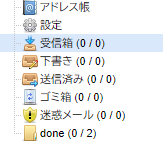

## 準備

### LINEグループ準備

今回の仕組みから自動投稿させるグループを決める。新しく作ってもよい。既存のものでもよい。

### LINE Notifyのアクセストークン取得

[LINE Notify](https://notify-bot.line.me/ja/)

ネットで検索すれば、アクセストークンの取得方法はたくさん出てくる。例えば、本ページ最下部の参考サイトなど。

- LINE Notifyのアクセストークンは1度しか表示されないのできちんとコピペしておくこと[^1]
- 【Generate token】を実施する際には、使いたいグループ（上述で設定したもの）を指定して発行すること
- アクセストークン発行時、グループを指定する画面の上側に入力するテキストボックスは、メッセージ投稿が起きるたびにメッセージ冒頭に投稿される。あまり長くない文字列がよさそう。

[^1]: 何かしら失敗したらやり直せばいいだけだが。

#### 動作確認

スクリプトを定期実行しようとしているCentOS上で以下のコマンドを実行する。

``` sh
curl -X POST -H "Authorization: Bearer <TOKEN>" -F "message=<TEXT>" https://notify-api.line.me/api/notify
```

`<TOKEN>` はLINEで発行したアクセストークン、 `<TEXT>` はLINEに送りたいメッセージとなる。


### メールボックス準備

「とりまとめメールボックス」を作成する。私が利用している `さくらのレンタルーサーバ` であれば、[ちょっと設定する](https://help.sakura.ad.jp/mail/2107/?article_anchor=js-nav-1)だけ。

#### アーカイブ用メールフォルダ作成

作成したメールボックス内にアーカイブ用のメールフォルダを作成する。今回は「done」という名前のフォルダにした。LINEへの通知処理が終わったメールはこちらに移動させる。



#### メールフォルダ名の確認

通常使っている範囲では、「メールをフォルダ移動させる」とは「マウスでドラッグ＆ドロップ」するだけだが、Pythonで処理するには「メールコピー＆オリジナル削除」という手順を踏む必要がある模様。

コピーするにしても移動するにしても、移動先のメールフォルダ名を正しく把握しなければならない。調べる。Pythonで以下を実行。

``` py title="メールボックス名称を調べる" linenums="1" hl_lines="5"
import imaplib
imaplib.IMAP4_SSL(SERVER_ADDRESS, IMAP_PORT)
imap.login(MAIL_ADDRESS, MAIL_PASSWORD)
imap.list()
> ('OK', [b'(\\HasNoChildren) "." "INBOX.done"', b'(\\HasNoChildren) "." "INBOX.Trash"', b'(\\HasNoChildren) "." "INBOX.spam"', b'(\\HasNoChildren) "." "INBOX.Sent"', b'(\\HasNoChildren) "." "INBOX.Draft"', b'(\\Unmarked \\HasChildren) "." "INBOX"'])
imap.close()
imap.logout()
```

`SERVER_ADDRESS`, `IMAP_PORT`, `MAIL_ADDRESS`, `MAIL_PASSWORD`はそれぞれの環境でサーバに接続するために設定する。例えばさくらのレンタルサーバなら、[このページ](https://help.sakura.ad.jp/mail/2114/?article_anchor=js-nav-0)に情報がある。

結果が長くてわかりにくいが、上記の結果（ハイライト行）から、移動させたいメールフォルダの正式名称が `"INBOX.done"` であることがわかった。

## 作成

[:material-github:GitHub:material-github:](https://github.com/ginteru/LINE_Notify.git)にあげた[^2]。以降、行数は今時点の数字なので、今後ソースファイルを修正する際にずれる可能性がある。参考程度。

[^2]: 公開するほどの価値もない、拙いスクリプトだとはわかっているが、とりあえず動いているのでよいかと思いまして…。

ほぼ `main.py` だけのスクリプト。

### logging.config読み取り

Windowsで開発し、Linuxで実行している。デフォルトエンコーディングはそれぞれcp932とutf-8。Python3.10ぐらいからは `logging.config.fileConfig` で `encoding` オプションが使えるようになっているので、utf-8で作ったファイルを、utf-8で指定して読み込めば両方で問題ない。今回、Linuxの環境はPython3.6.8なので、このオプションが使えずそのままだとエラーになる。

``` py title="OSによって読み込みオプションを変える（対処療法）" linenums="25"
if os.name == 'nt':
    logging.config.fileConfig('logging.conf', encoding="utf-8")
else:
    logging.config.fileConfig('logging.conf')
```

Pythonが新しいWindows側では、オプション指定できるのでそれを使い、Linux側では指定しなくてもutf-8なのでそのまま読み込むようにした。

本来は実行環境を整えることが正しいと思ってはいる。

### msgの処置関数

``` py title="関数いただきました" linenums="79"
def get_jp_encoding_name(msg, char_code='iso-2022-jp'):
    try:
        enc = chardet.detect(msg)
        return enc['encoding']
    except:
        return char_code


# msg から本文を取得
def get_content(msg):
    try:
      ...
```

この部分のmsg処理関数は、参考サイト(2番目)からコピペさせてもらった。

### メールのデコード（手抜き）

``` py title="デコード処理の手抜き" linenums="148"
        try:    # 手抜き
            ms = email.message_from_string(x[0][1].decode('iso-2022-jp'))
        except:
            ms = email.message_from_string(x[0][1].decode('UTF-8'))
            ...
```

メールによって、エンコード方式が違っていたので、2つで試せば何とかなるだろう、という安易な理由で処理を入れた。

### メールボックス内フォルダ移動

``` py title="処置したメールのフォルダ移動" linenums="183"
        # メールを格納して削除
        logger.info('メールを格納して削除')
        temp = imap.copy(i, "INBOX.done")
        logger.info('imap.copy:{0}'.format(temp))
        temp = imap.store(i, '+FLAGS', r'(\deleted)')
        logger.info('imap.store-FLAGS:{0}'.format(temp))
    
    # 削除フラグの実行
    temp = imap.expunge()
    logger.info('imap.expunge:{0}'.format(temp))
    ...
```

メールをフォルダに移動するには、コピーして削除、の処理を行う必要がある。上記のうち、 `"INBOX.done"` が環境ごとに異なるであろう設定となる。

## 実装

CentOSで継続動作させる。

適切なディレクトリに移動し、ソースを何らかの手段で配置するところは省略。

``` bash linenums="1"
# 場所移動
$ cd /path/to/src/

# 仮想環境を作る
$ python3 -m venv .venv

# 仮想環境に入る
$ . ./.venv/bin/activate

# pip updateと必要なパッケージインストール
(.venv)$ pip install --upgrade pip
(.venv)$ pip install requests chardet

# 環境確認
(.venv)$ python --version
Python 3.6.8
(.venv)$ pip freeze
certifi==2022.6.15
chardet==5.0.0
charset-normalizer==2.0.12
idna==3.3
requests==2.27.1
urllib3==1.26.12

# 環境を抜ける
(.venv)$ deactivate
```

### テスト実行

cronで実行するにあたり、マニュアルで実行する。事前、もしくは動作中の任意のタイミングで、とりまとめメールボックスにメールを投げておく。

``` sh linenums="1"
# 1分間弱、10secおきにメールチェックする
$ cd /usr/local/src/LINE_Notify; .venv/bin/python main.py

# 1回だけ確認する
#   上の処理とかぶっても影響が少ないように、終わった頃を見計らって待ってから動作
$ cd /usr/local/src/LINE_Notify; .venv/bin/python main.py 1
```

実行結果は `log/LINE_Notify.log` に保存される。必要に応じて、 `logrotate` でlog世代管理しておく。

### cron設定

以下を設定して、継続動作させる。

``` sh linenums="1"
$ sudo vi /etc/crontab
$ cat /etc/crontab
...
# LINE Notify
### リアルタイム把握したい期間用(金曜の15時～20時までの毎分)
 *  15-20  *  *  fri user1 cd /patu/to/src; .venv/bin/python main.py
### 毎時00分,30分に確認
0,30 *  *  *  * user1 cd /patu/to/src; .venv/bin/python main.py 1
...
```

## 参考サイト

- [【line notify】pythonでlineへ通知してみよう！](https://rooter.jp/web-crawling/line-notify_with_python/)    
  LINE Notifyのアクセストークン取得など。画像があってわかりやすい。
- [Python3でメールを受信してLINEグループへ通知](https://www.akiratin.com/python3%E3%81%A7%E3%83%A1%E3%83%BC%E3%83%AB%E3%82%92%E5%8F%97%E4%BF%A1%E3%81%97%E3%81%A6line%E3%82%B0%E3%83%AB%E3%83%BC%E3%83%97%E3%81%B8%E9%80%9A%E7%9F%A5/)  
  特にメールmsg部分の処置関数を流用させていただいた。
- [IMAP Pythonでメール受信を行う方法 email imaplib](https://blog.fascode.net/2021/10/08/imap-python-email-imaplib/)  
  シンプルにまとまっているので全般的に参考にさせていただいた。
