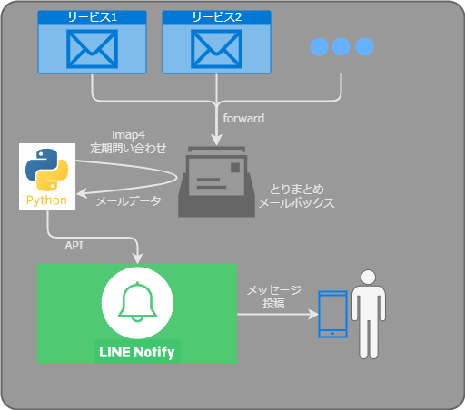

## 概要

<figure markdown>
  
  <figcaption>構成概要図</figcaption>
</figure>

利用サービスから送られてくるメール通知の宛先を「とりまとめメールボックス」に集める。 `さくらのレンタルサーバ` で自由にメールボックスが作れるので、専用のメールアドレスを準備する。

常時稼働のCentOS上でPythonスクリプトを動かし、「とりまとめメールボックス」のメールを定期的に取得する。取得したデータをLINE Notifyに送り、設定したLINEチャットへ内容投稿してもらう。

## 要件

ほぼリアルタイムで把握したい事象発生は、曜日と時間帯が決まっているので、その間は短い間隔でメール受信を確認しに行きたい。他の時間帯は予期せぬメールが届いていないか定期的に確認しにいく程度。

Pythonはcronで起動するが、分単位の起動になるので、スクリプト内でループして10secごと[^1]に受信確認する。秒単位で受信確認時刻が統一されていなくても特に問題はない。

[^1]:   特に理由はない。アバウト。

メールには色々な要素（From、To、Subject、bodyなど）がある。今のところ、必要なのは本文だけで、添付ファイルも不要。LINEへの通知は本文のみを送ればそれでよい。

LINEへの通知が終わったら、そのメールは不要になるが、その場で削除してしまうのは抵抗がある[^2]。チェックしたメールは、メールボックス内の別のフォルダに移動させておく。

[^2]:   何かあったときに調べられなくなるし。
